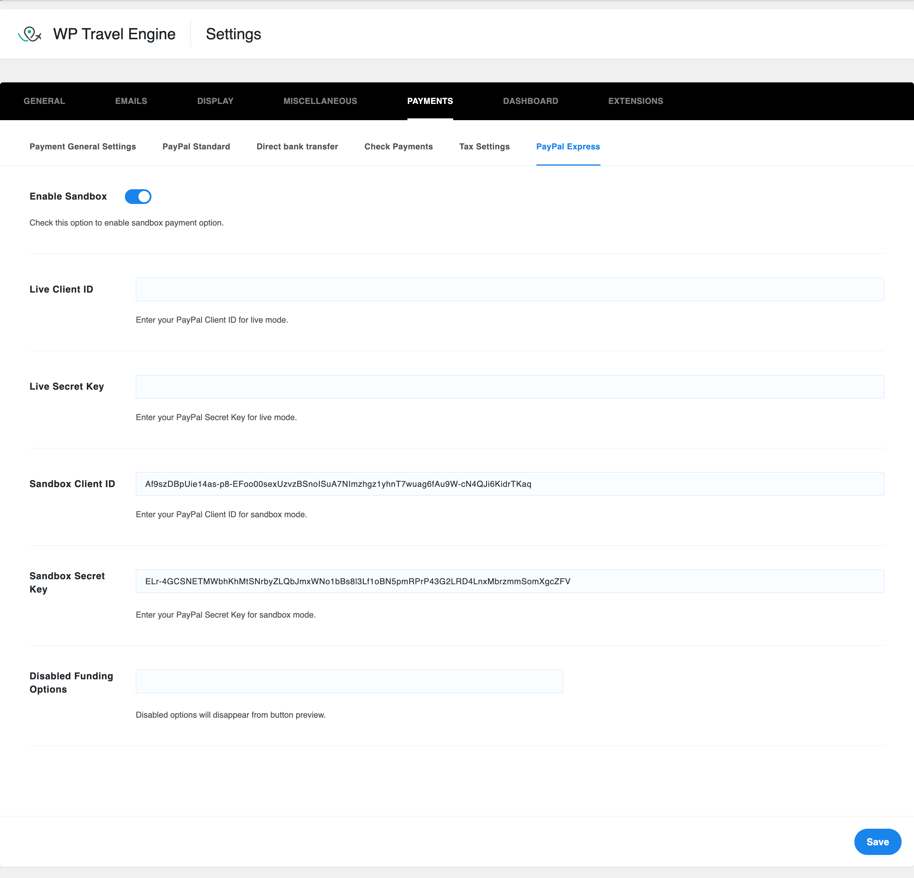
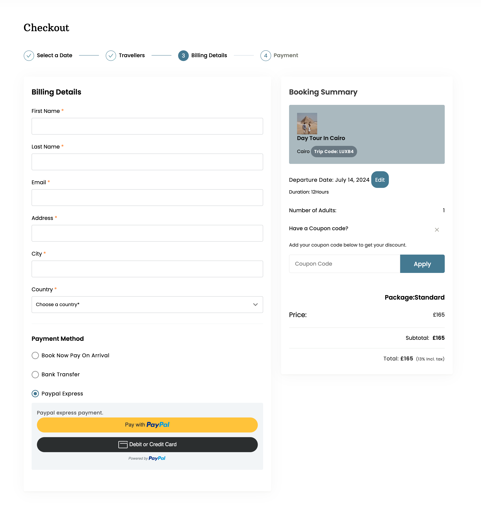

# WP Travel Engine - PayPal Express Payment Addon

This is an addon for the [WP Travel Engine](https://wptravelengine.com/) WordPress plugin that enables PayPal Express checkout for payment. This addon allows users to quickly and securely make payments through PayPal Express.

## Features

- Seamless integration with WP Travel Engine.
- Quick and secure payments via PayPal Express.
- Easy to configure and use.

## Installation

1. Download the plugin zip file from the [releases page](https://github.com/algo-tushar/Wp-Travel-Engine-Paypal-Express-Addon/releases).
2. Go to your WordPress admin dashboard.
3. Navigate to Plugins > Add New.
4. Click on the "Upload Plugin" button and choose the downloaded zip file.
5. Click "Install Now" and then "Activate" the plugin.

## Configuration

1. After activating the plugin, go to WP Travel Engine > Settings.
2. Navigate to the "Payments" tab.
3. Select "PayPal Express" and fill in the required fields with your PayPal API credentials.

## Usage

Once the plugin is configured, PayPal Express will appear as a payment option during the checkout process on your travel booking site.

## Contributing

1. Fork the repository.
2. Create a new branch (`git checkout -b feature-branch`).
3. Commit your changes (`git commit -am 'Add some feature'`).
4. Push to the branch (`git push origin feature-branch`).
5. Open a pull request.

## License

This project is licensed under the MIT License. See the [LICENSE](LICENSE) file for more details.

## Support

For support or any questions, please [open an issue](https://github.com/algo-tushar/Wp-Travel-Engine-Paypal-Express-Addon/issues)